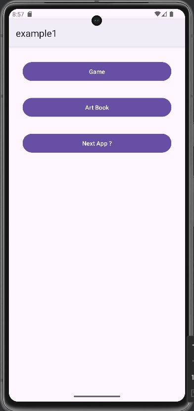
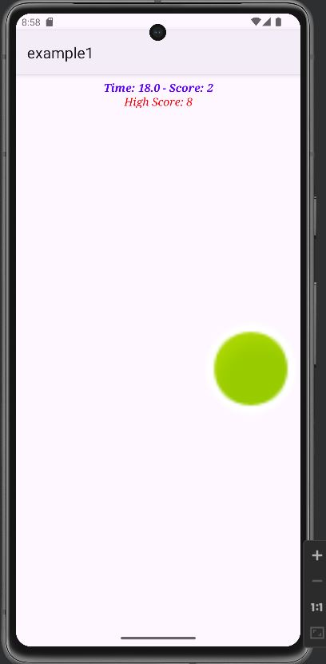
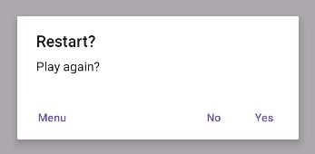
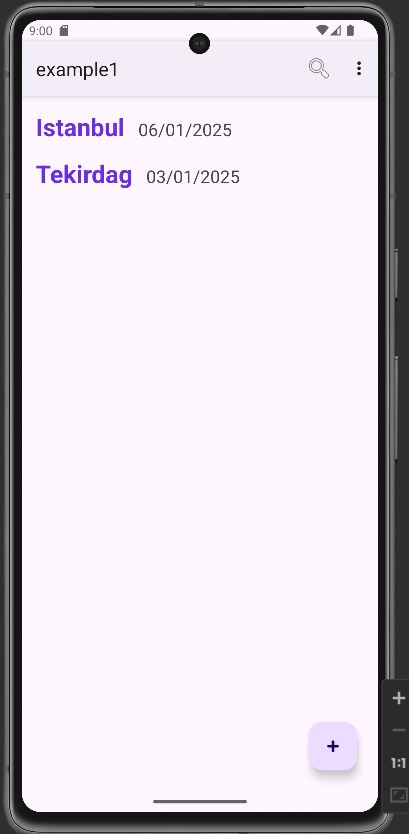
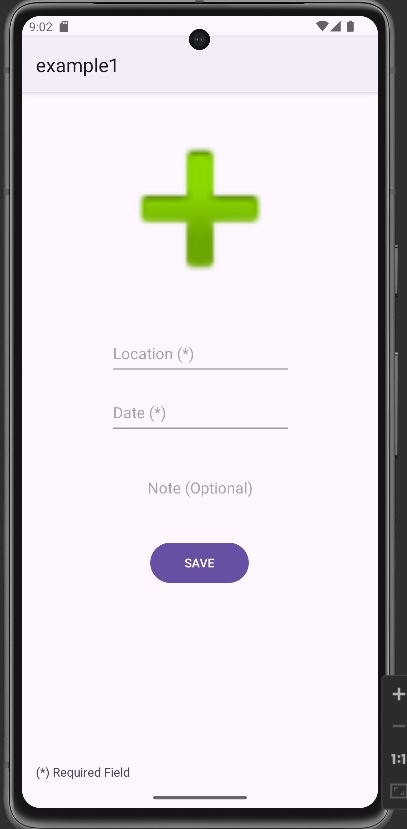
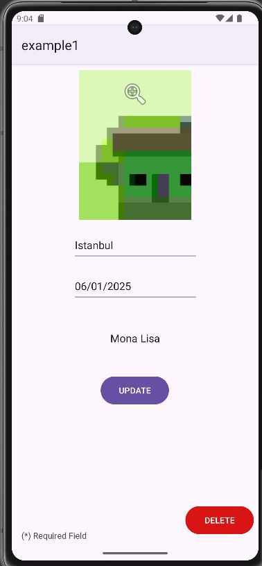
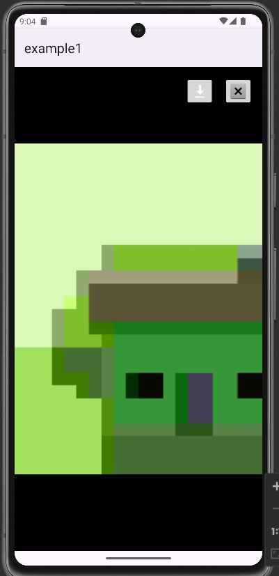

# MultiApp_ArtBook_CatchGame_Kotlin

MultiApp_ArtBook_CatchGame_Kotlin, tek bir uygulama içinde iki farklı uygulamayı bir araya getiren bir projedir. Açılış ekranında kullanıcıya iki seçenek sunar:
1. **ArtBook** – Kullanıcının seçtiği resim, tarih, not gibi bilgileri Room veritabanına kaydetmesini sağlar.
2. **Catch Game** – Refleks testi üzerine kurulu eğlenceli refleks oyunu.

Bu proje, test amaçlı olarak geliştirilmiş ve Kotlin programlama dilindeki becerileri geliştirmek için hazırlanmıştır.

## Özellikler
### **ArtBook**
- Kullanıcı, galeriden bir resim seçerek kaydedebilir.
- Kaydedilen resimler Room veritabanında saklanır.

### **Catch Game Modülü**
- Kullanıcının ekranda rastgele beliren objeye en kısa sürede dokunmasını gerektiren bir refleks oyunu.
- Zaman bazlı skor takibi.
- Oyun içinde kullanıcıya anlık skor gösterimi.
- Shared preferences ile highscore takibi.

## Kullanılan Teknolojiler
- **Kotlin**
- **Room Database** (ArtBook için veri saklama)
- **SharedPreferences** 
- **Handler & Runnable** (Catch Game için zamanlayıcı mekanizması)

## Ekran Görüntüleri
Aşağıda uygulamanın bazı ekran görüntüleri bulunmaktadır:

      
    
    

